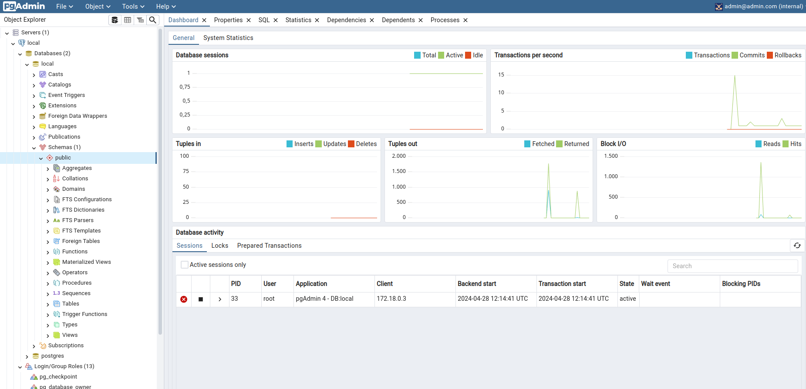
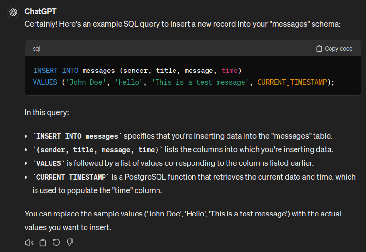
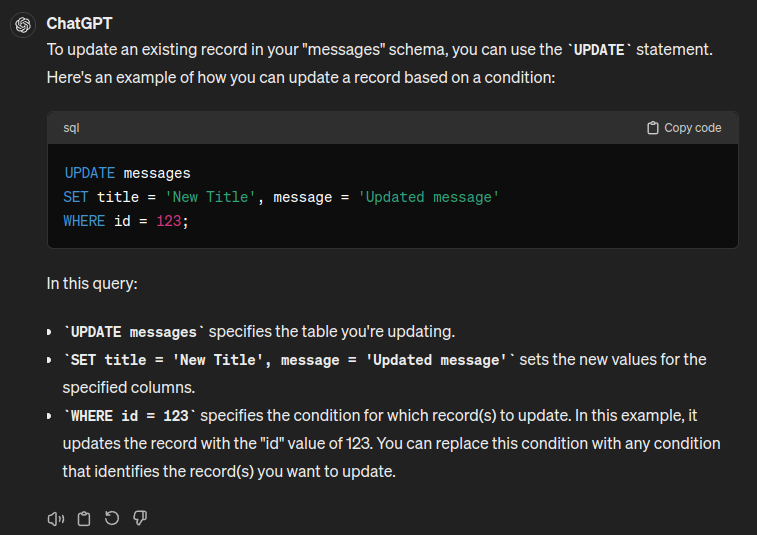
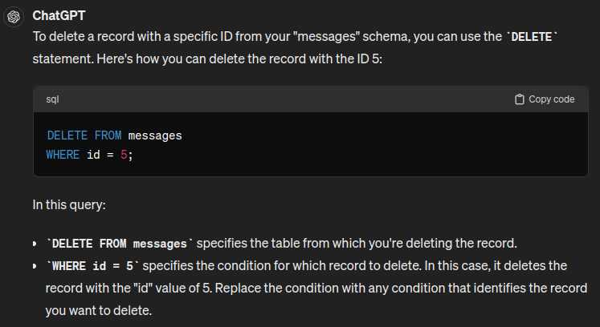

# Tech Academy React Project—Databases, REST APIs and React Web Applications

Welcome to the advanced Web Development Track by TechAcademy. In this project we will learn the basics of PostgreSQL, a widely used SQL database in web development, REST APIs that connect our databases with our frontends and React, an industry standard framework in web development. With React, you can program graphical user interfaces for web applications, but also for mobile systems like Android and iOS as well as desktop environments like Windows, macOS and Linux. We hope you will enjoy this course and take a lot of benefits from it.

## Prerequisites

### Install the necessary tools

Before we start, we need to install some tools first. First, we need an IDE (integrated development environment) for developing our app. We recommend Visual Studio Code, which has become the most popular free IDE within the last years. You can download it at the following page:

* https://code.visualstudio.com

Next, we need Node.js, which is the runtime environment for our React application. React apps are written in JavaScript, which cannot be executed directly by a computer. This is why we need Node.js. Node.js can be downloaded from the following page (you should download the LTS version):

* https://nodejs.org/en/

After you have installed Node.js open a terminal and type the following command and execute it:

```bash
node --version
```

This should print the Node.js version number to the console if Node.js was installed correctly. That's it. We are ready to create our first React app.

## Prerequisites - Setup Postgres

PostgreSQL is an open-source relational database management system (RDBMS) that is widely used for managing and organizing large amounts of structured data. It provides a powerful and flexible platform for storing and retrieving data efficiently.

PostgreSQL follows a relational database model, which means it organizes data into tables with predefined structures. These tables consist of rows (records) and columns (attributes), allowing you to store and manipulate data in a structured manner. It enables you to store and organize large amounts of structured data efficiently. You can create tables to represent different entities and store relevant information in a well-structured manner. Also, PostgreSQL provides a powerful query language called SQL (Structured Query Language) that allows you to retrieve and manipulate data from the database. You can perform complex queries, filtering, sorting, aggregations, and join operations to extract the information you need.

### Installation

1.  Go to the PostgreSQL [website](https://www.postgresql.org/download/) and download the latest PostgreSQL version


2.  Run the installer. You should see a window like the following one:


3.  You have to specify the installation directory of PostgreSQL. You should not change this value.


4.  When you are asked which components you want to install, select all the components.


5.  The data directory should be left as it is.


6. Now you need to define a password for the database. On local systems usually something easy like `root` is used, but only if the database only runs on your local machine. For a database that runs on a server, you should choose a better password. Also remember this password, we will need it later when we connect our REST API to the database.


Now we need to specify a port on which the database listens to. The default port is 5432 and should be left as it is. So our database will be accessible under `localhost:5432` or `127.0.0.1:5432`.


The advanced settings should not be changed.

## Prerequisites - pgAdmin

PgAdmin is an application that provides a GUI for our postgres database. It should have been installed with PostgreSQL together. Otherwise, go to this [website](https://www.pgadmin.org/download/) and download pgAdmin.

After starting pgAdmin we should see a dashboard similar to the following one:

<figure><figcaption><p>This screenshot is taken from a personalized instance of postgresql/pgadmin - databases are listed on the left, and one named "postgres" will - by default - already be present for you to use</p></figcaption></figure>

Click on the `postgres` database in the left sidebar. This is the default database created by PostgreSQL. We will work with that database. Next click on the `Query Tool` icon, which is the icon right to the "Browser" text. Now a query console should be visible like you see it in the image. Past the following SQL code into the query console:

```SQL
CREATE TABLE IF NOT EXISTS "users"
(
    "id"              SERIAL PRIMARY KEY,
    "username"        VARCHAR(255) UNIQUE,
    "hashed_password" VARCHAR(255),
    "height"          VARCHAR(255),
    "weight"          VARCHAR(255),
    "role"            VARCHAR(255)
);

CREATE TABLE IF NOT EXISTS "messages"
(
    "id"      SERIAL PRIMARY KEY,
    "sender"  varchar(255),
    "title"   VARCHAR(255),
    "message" VARCHAR(255),
    "time"    TIMESTAMP NOT NULL DEFAULT NOW()
);
-- athlete und user zusammengefasst

CREATE TABLE IF NOT EXISTS "tasks"
(
    "task_id"     SERIAL PRIMARY KEY,
    "description" VARCHAR(255),
    "assignee"    VARCHAR(255),
    "link"        VARCHAR(255),
    "due"         TIMESTAMPTZ NOT NULL,
    CONSTRAINT fk_tasks_username FOREIGN KEY (assignee) REFERENCES users (username)
);
```

Press F5 or click on the triangle above the query console. This should create three tables in our database.


### Explaining the SQL code

The given SQL code is creating three tables in a PostgreSQL database: "users," "messages," and "tasks." Let's go through each table and explain their columns and constraints.

_**Table "users":**_

_Columns_:

* _**id**_: SERIAL data type, which is an auto-incrementing integer used as the primary key for each user.
* _**username**_: VARCHAR(255) data type, representing the username of the user. It is also marked as UNIQUE, ensuring that each username is unique in the table.
* _**hashed\_password**_: VARCHAR(255) data type, representing the hashed password of the user.
* _**height**_: VARCHAR(255) data type, representing the height of the user.
* _**weight**_: VARCHAR(255) data type, representing the weight of the user.
* _**role**_: VARCHAR(255) data type, representing the role of the user.

_**Table "messages":**_

_Columns:_

* _**id**_: SERIAL data type, serving as the primary key for each message.
* _**sender**_: VARCHAR(255) data type, representing the sender of the message.
* _**title**_: VARCHAR(255) data type, representing the title of the message.
* _**message**_: VARCHAR(255) data type, representing the content of the message.
* _**time**_: TIMESTAMP data type, NOT NULL constraint, with a default value of the current timestamp (using the NOW() function). This column captures the time when the message is created.

_**Table "tasks":**_

_Columns:_

* _**task\_id**_ SERIAL data type, serving as the primary key for each task.
* _**description**_: VARCHAR(255) data type, representing the description of the task.
* _**assignee**_: VARCHAR(255) data type, representing the username of the user to whom the task is assigned.
* _**link**_: VARCHAR(255) data type, representing a link related to the task.
* _**due**_: TIMESTAMP data type, NOT NULL constraint, representing the due date and time of the task.

_Constraints:_

* _**fk\_tasks\_username**_: This is a foreign key constraint that references the "username" column in the "users" table. It ensures that the "assignee" column in the "tasks" table contains values that already exist in the "username" column of the "users" table. Overall, these tables and their columns provide a basic structure for storing information about users, messages, and tasks in a PostgreSQL database.

#### What is a VARCHAR?

In SQL, VARCHAR is a data type used to store variable-length character strings. The number inside parentheses after VARCHAR specifies the maximum length of the string that can be stored in that column.

In the given SQL code, VARCHAR(255) is used to define several columns, such as "username", "hashed\_password", " height", "weight", "role", "sender", "title", "message", "description", "assignee", and "link".

VARCHAR(255) means that these columns can store character strings with a maximum length of 255 characters. The actual length of the stored string can be any value up to 255 characters. If you try to insert a string longer than 255 characters into a column defined as VARCHAR(255), the database will truncate the string to fit the specified length.

The choice of 255 as the maximum length is common but not necessarily the optimal choice for every situation. The length specified should be based on the expected data requirements and constraints of your specific application. If you expect that the stored strings will typically be shorter, you can reduce the maximum length to save storage space. On the other hand, if you expect longer strings, you can increase the maximum length accordingly.

It's worth noting that the length specified in VARCHAR does not directly impact the storage space. The actual storage space used will depend on the length of the data being stored.

#### What are primary keys?

A primary key is a column or a set of columns in a table that uniquely identifies each row or record in that table. It serves as a unique identifier for the data in the table and ensures that there are no duplicate or null values in the primary key column(s). Each table in a relational database should have a primary key defined.

Here are some key characteristics of primary keys:

_**Uniqueness:**_ Each value in the primary key column(s) must be unique, meaning no two rows in the table can have the same primary key value. This uniqueness constraint helps to differentiate and identify individual records.

_**Non-nullability:**_ Primary key columns cannot contain null values. Every row must have a valid and non-null value in the primary key column(s).

_**Indexing:**_ Primary keys are typically indexed automatically by the database system. This indexing improves the performance of queries that involve searching, joining, or referencing the primary key column(s).

_**Referential integrity:**_ Primary keys often play a role in establishing relationships with other tables through foreign keys. Foreign keys in other tables can reference the primary key column(s) of a table, creating a link between related data and enforcing referential integrity.

In the given SQL code, the "id" column in the "users" table, the "id" column in the "messages" table, and the "task\_id" column in the "tasks" table are all defined as primary keys. These primary keys uniquely identify each row in their respective tables and ensure data integrity and efficient querying.

#### What are foreign keys?

Foreign keys are a fundamental concept in relational databases, including PostgreSQL. A foreign key is a column or a set of columns in a table that establishes a link or relationship between the data in two tables. It enforces referential integrity, meaning that it ensures that the data in the referencing table (child table) corresponds to the data in the referenced table (parent table).

In the context of the given SQL code, the "fk\_tasks\_username" constraint in the "tasks" table is an example of a foreign key. It references the "username" column in the "users" table. This means that the "assignee" column in the "tasks" table can only contain values that already exist in the "username" column of the "users" table. If you try to insert or update a row in the "tasks" table with an "assignee" value that does not exist in the "users" table, it will result in a foreign key constraint violation and the operation will fail.

Foreign keys are useful for maintaining data integrity and enforcing relationships between tables. They help ensure that data remains consistent and accurate across different tables in a database. They also facilitate join operations, allowing you to retrieve related data from multiple tables based on their established relationships.

### Looking at the tables

Now click on `Schemas` in the left sidebar. Here you can see the tables (also called schemas) of your database. Expand the `public` list and then click on `Tables (3)`. Here you can see the tables we have created.


You can also view the columns of a table by clicking on `Columns` under the table name.


### Look at the data of the table

Now we want to inspect the data in our table. For that click on the table name (`messages` in this example) and then on the `View Data` button above the sidebar.


We now see the data inside our `messages` table. Because we haven't added any data, we won't see any records.

pgAdmin also displays the SQL query that can be used for producing the shown result. In this example, the query for querying all messages would be:

```SQL
SELECT *
FROM public.messages
ORDER BY id ASC
```


Now let's add some data. For that we click on the `Query Tool`button again and insert the following query into the SQL console:

```SQL
INSERT INTO messages (sender, title, message, time)
VALUES ('John', 'Call at 2pm', 'We arranged a call at 2pm', now());
```

Press F5 or click on the triangle button to execute this query. You should see the message `Query returned successfully`. This means the data has been added to our table.


Now again select the `messages` table and click on the `View Data` button. You should now see the record displayed in the table of results.


***

## Knowledge nugget: Using ChatGPT to create SQL queries

A new software named ChatGPT has arrived to the market which will be part of every developer's daily used tools. ChatGPT is a powerful chatbot that is able to write code based on a natural language question the user asks. Let's see how we can use ChatGPT to create new SQL queries.

First let's ask ChatGPT the following question:

```
I have a PostgreSQL database with a schema named "messages". The schema has the following attributes:

- "id" which is a primary key that is set automatically
- "sender" which is of type character varying
- "title" which is of type character varying
- "message" which is of type character varying
- "time" which is a timestamp without timezone

I want to add new records to this schema. Can you write me the SQL query for that task?
```

ChatGPT created the following answer for me:

<figure><figcaption><p>ChatGPT came up with something you did not find useful? No problem! Click on the "redo" arrow in the bottom left, and it will try again, with a usually slightly different response</p></figcaption></figure>

Now let's ask ChatGPT how we can update an existing record in the database.

```
I want to update an existing record. How can I do this?
```

This is the response of ChatGPT:

<figure><figcaption><p>Updating data requires a 'WHERE clause', which ChatGPT correctly provided</p></figcaption></figure>

Finally, let's ask ChatGPT how we can delete records from our database.

```
I want to delete the record with the ID 5. How can I do this?
```

And the answer is:

<figure><figcaption><p>Notice how 'DELETE' also has a 'WHERE' clause? Avoid forgetting that clause, unless you'd like to 'DROP' your database</p></figcaption></figure>

### Asking ChatGPT more questions

It's your turn now. Ask ChatGPT the following questions and try the SQL code generated by ChatGPT. How do you like it?

Questions:

* I want to get all users with the name "John"
* I want to get all messages of the last 24 hours
* I want to update the timestamp of the message with the ID 2 to the current time
* I want to delete the messages with the IDs 2, 4 and 7
* I want to update all messages where the user equals "John" to "Jane"
* How can I order the results by the timestamp?
* How can I add a new column named "read" of type boolean to the schema?

***

## Prerequisites - Using programming languages to query databases

Now that we successfully have installed PostgreSQL, created our tables and inserted some data into it. We want to use the data of those tables in our programs. For PostgreSQL, nearly any modern programming language has libraries that allow us to query these tables. In this section, we want to try to query the Database first with Python and then with JavaScript.

### Using Pyhon to query the database

For this example, I assume you have installed Python v3 on your machine. You also need to install the `psycopg2` library by running the command `pip install psycopg2`.

Let's create a file named `app.py` on our local machine with the following code:

```py
import psycopg2

# Establish a connection to the PostgreSQL database
conn = psycopg2.connect(
    host="localhost",
    port=5432,
    database="postgres",
    user="postgres",
    password="root"
)

# Create a cursor object to execute SQL queries
cur = conn.cursor()

# Execute the SELECT query to fetch all records from the "messages" table
cur.execute("SELECT * FROM messages")

# Fetch all the rows returned by the query
rows = cur.fetchall()

# Iterate over the rows and print the data
for row in rows:
    print("ID:", row[0])
    print("Sender:", row[1])
    print("Title:", row[2])
    print("Message:", row[3])
    print("Time:", row[4])
    print()

# Close the cursor and connection
cur.close()
conn.close()
```

Now if we run the script by using the command `python app.py` we should get the following output:

```bash
$ python app.py 
ID: 2
Sender: John
Title: Call at 2pm
Message: We arranged a call at 2pm
Time: 2023-05-03 17:09:21.098497
```

### Using JavaScript to query the database

Now let's use JavaScript for querying the database. I expect that you have installed Node.js on your machine for that tutorial.

Create a new directory on your machine, open a console and run the following command: `npm init`. This creates a new JavaScript project in this directory. NPM (which is the package manager for Node.js, like pip for Python) will ask you some questions, just click enter every time, it is not important for this example. After answering all the questions, NPM asks you to run the command `npm install pg`. This will install the `pg` library that is needed for our script.

Now let's create a file named `app.js` with the following content:

```js
const {Client} = require('pg');

// Create a new PostgreSQL client instance
const client = new Client({
    user: 'postgres',
    password: 'root',
    host: 'localhost',
    database: 'postgres',
    port: 5432, // Default PostgreSQL port
});

// Connect to the PostgreSQL database
client.connect()
    .then(() => {
        // Execute the SELECT query to fetch all records from the "messages" table
        return client.query('SELECT * FROM messages');
    })
    .then((result) => {
        const rows = result.rows;

        // Iterate over the rows and log the data
        rows.forEach((row) => {
            console.log('ID:', row.id);
            console.log('Sender:', row.sender);
            console.log('Title:', row.title);
            console.log('Message:', row.message);
            console.log('Time:', row.time);
            console.log();
        });
    })
    .catch((error) => {
        console.error('Error:', error);
    })
    .finally(() => {
        // Disconnect the client and release resources
        client.end();
    });
```

Execute the script by typing the following command in your console: `node app.js`. The result on the console should look like this:

```bash
$ node app.js
ID: 2
Sender: John
Title: Call at 2pm
Message: We arranged a call at 2pm
Time: 2023-05-03T15:09:21.098Z
```

That's great. We can now write software that is able to execute SQL queries, retrieve data from our database, and much more. It is your term now to try more SQL queries. You should:

* Insert new data into the messages table
* Update existing records on the messages table
* Delete records from the messages table

## Prerequisites—The HTTP protocol

The HTTP (Hypertext Transfer Protocol) is a protocol that governs the communication between web browsers and web servers. It enables the transfer of hypertext, which includes various types of data such as text, images, videos, and other multimedia content, over the Internet.

Here's a general overview of how the HTTP protocol works:

_**Client-Server Model**_: HTTP follows a client-server model, where the client (usually a web browser) sends a request to the server, and the server responds with the requested data.

_**Request-Response Cycle**_: The communication between the client and server occurs in a series of request-response cycles. The client initiates a request, and the server responds with the requested data or an error message.

_**URL and Methods**_: To make a request, the client specifies the Uniform Resource Locator (URL) of the desired resource. The URL includes the protocol (HTTP), domain name or IP address of the server, and the path to the resource. The client also includes an HTTP method in the request, such as GET, POST, PUT, DELETE, etc., to indicate the desired action to be performed on the resource.

_**Headers**_: The request and response messages include headers that contain additional information about the request or response. Headers can include details like the content type, caching instructions, authentication credentials, and more.

_**Request Body and Parameters**_: For certain methods like POST or PUT, the client can include a request body that contains additional data to be sent to the server. The body can contain form data, JSON, XML, or other formats. The client can also send parameters in the URL or in the request body to provide additional information to the server.

_**Status Codes**_: The server responds to the client's request with an HTTP status code. Status codes indicate the outcome of the request, such as whether it was successful, encountered an error, or requires further action. Common status codes include 200 (OK), 404 (Not Found), 500 (Internal Server Error), and many more.

_**Response Body**_: The server sends back the requested data as the response body. The data can be in various formats like HTML, JSON, XML, or plain text, depending on the nature of the requested resource and the Accept header sent by the client.

HTTP is a stateless protocol, meaning each request-response cycle is independent of others, and the server does not maintain any information about the client's previous requests.

Overall, the HTTP protocol forms the foundation for communication on the World Wide Web, enabling the retrieval and transfer of resources between clients and servers.

## Chapter 1—Creating the REST API

## Prerequisites—Understanding REST APIs

### What is a REST API?

A REST API (Representational State Transfer Application Programming Interface) is a software architectural style that defines a set of rules and conventions for building and interacting with web services. It is widely used to create web services that can be accessed and consumed by clients over the internet.

REST APIs are based on the principles of the HTTP protocol, which is the foundation of the World Wide Web. They use standard HTTP methods like GET, POST, PUT, and DELETE to perform operations on resources exposed by the API. These resources can be in various formats, such as JSON (JavaScript Object Notation) or XML (eXtensible Markup Language).

The main purpose of a REST API is to provide a standardized and scalable way for different software systems to communicate and exchange data. Here are some reasons why we need REST APIs:

_**Client-Server Communication**_: REST APIs enable communication between client applications (such as web browsers, mobile apps, or other servers) and server-side applications. Clients can send HTTP requests to the API to retrieve or manipulate data stored on the server.

_**Platform Independence**_: REST APIs are platform-independent, meaning clients and servers can be developed using different programming languages and technologies as long as they adhere to the common rules and conventions of the REST architecture. We already have seen that we can use nearly any programming language for querying databases, and that is true for writing REST APIs too.

_**Scalability**_: REST APIs allow for the separation of concerns between the client and server. This allows each component to be developed, deployed, and scaled independently, making it easier to handle increased traffic or load on either side.

_**Statelessness**_: REST APIs are stateless, which means that each request from a client contains all the necessary information to be understood by the server. The server does not need to maintain any session state between requests, simplifying the architecture and making it more scalable.

_**Resourceful Operations**_: REST APIs expose resources as URLs (Uniform Resource Locators), and clients can perform various operations on these resources using standard HTTP methods. For example, a client can use a GET request to retrieve data, a POST request to create new data, a PUT request to update existing data, or a DELETE request to remove data.

Integration and Interoperability: REST APIs facilitate integration between different systems and applications. They provide a common language and interface for different software components to communicate and exchange data, allowing for the development of complex and distributed systems.

### Creating a small REST API with Python

Now let's build a small REST API with Python. We will use the `Flask` library for creating this REST API. You can install Flask by running the command `pip install Flask`.

Now create a new file named `api.py`with the following content:

```py
from flask import Flask

app = Flask(__name__)


@app.route('/')
def hello_world():
    return 'Hello, World!'


if __name__ == '__main__':
    app.run()
```

Execute the command `python api.py`. After that open a Browser and open the URL `http://localhost:5000`.


Now let's add another endpoint to our API by adding the following code to our Python script:

```py
@app.route('/site')
def site():
    html_code = '<html><head><title>My Site</title></head><body><h1>Hello, World!</h1></body></html>'
    return html_code
```

After that you need to restart the API by again running the command `python api.py`. Visit the URL `http://localhost:5000/site`. This is what you should see:


The API has just returned an HTML website. I have a little exercise for you now: Change the color of the h1 tag to blue (or another color you like) by modifying the HTML code returned by our endpoint. Use the `style` attribute of the h1 tag.

### Querying the database and returning the result as a JSON object

Now we want to do something really fancy. We want to query our database like we did it in the script we have written before and return the records as a JSON object, so that we can use them in a frontend web application.

Modify your Python script like this:

```py
from flask import Flask, jsonify, request
import psycopg2
import psycopg2.extras

app = Flask(__name__)

# Establish a connection to the PostgreSQL database
conn = psycopg2.connect(
    host="localhost",
    port=5432,
    database="postgres",
    user="postgres",
    password="root"
)


@app.route('/messages')
def data():
    try:
        # Create a cursor to perform database operations
        cur = conn.cursor(cursor_factory=psycopg2.extras.RealDictCursor)

        # Execute the SELECT query
        cur.execute("SELECT * FROM messages")

        # Fetch all rows from the result set
        rows = cur.fetchall()

        # Close the cursor
        cur.close()

        # Return the rows as a JSON response
        return jsonify(rows)

    except (psycopg2.Error, psycopg2.DatabaseError) as error:
        print("Error retrieving data from PostgreSQL:", error)

    return jsonify([])


if __name__ == '__main__':
    app.run()
    conn.close()
```

Restart the Python app, go to the browser and visit the following URL: `http://localhost:5000/messages`. This is what you should see:

\#TODO&#x20;

Isn't that great? We have programmed an interface for our database that can now be used by webapps, mobile apps and any other software.


**Re-Creating the same REST API in JavaScript**

Earlier it was mentioned that nearly any modern programming language can be used for writing REST APIs - here's how to re-create the previous Python REST-API in JavaScript.

\
First, create a new JavaScript project by running `npm init` as previously demonstrated.

_(Reusing your existing project is also possible.)_

\
Next, prepare the required _dependencies_ by installing them using `npm install express pg`.\
\
`express` is an equivalent to Flask, meaning it will help create REST endpoints in JavaScript just like Flask did with Python.\
\
Lastly, create a file named `api.js`, and insert these lines:\


```javascript
const express = require('express');
const app = express();
const {Pool} = require('pg');

// Database connection configuration
const pool = new Pool({
    user: 'postgres',
    password: 'root',
    host: 'localhost',
    database: 'postgres',
    port: 5432,
});

app.get('/', (req, res) => {
    res.send('Hello, World!');
});

app.get('/site', (req, res) => {
    const htmlCode = '<html><head><title>My Site</title></head><body><h1>Hello, World!</h1></body></html>';
    res.send(htmlCode);
});

app.get('/messages', (req, res) => {
    pool.query('SELECT * FROM messages', (error, result) => {
        if (error) {
            console.error('Error retrieving data from PostgreSQL:', error);
            res.json([]);
        } else {
            res.json(result.rows);
        }
    });
});

app.listen(5000, () => {
    console.log('Server is running on port 3000');
});
```

Start the JavaScript implementation of the API using `node api.js`.

This process might fail if you still have your Python API up and running, so make sure you stopped it first.


Using your browser to navigate to...

* http://localhost:5000
* http://localhost:5000/site
* http://localhost:5000/messages

you can check how well the JavaScript API is doing.


See any difference?&#x20;

You should not, as both implementations serve exactly the same content.


### Querying the API

It is possible to query REST APIs using programming languages.

The following shows implementations in both, Python and JavaScript, although the main focus should be Python.

Note that, regardless which programming language you pick for querying and your REST API, the results (or in this specific case, `responses`) should be equivalent!

#### Using HTTP GET to receive data

`HTTP GET` is used to simply receive data. In the following example, it is used for querying `messages.`



Create a file named `query.py` with the following content:

```python
import requests
import json

url = 'http://localhost:5000/messages'  # Replace with your API endpoint URL

response = requests.get(url)

if response.status_code == 200:
    data = response.json()
    print(json.dumps(data, indent=4))
else:
    print('Error:', response.status_code)
```

Next, start your Python REST API, and execute the script you created by running `python query.py`.



Create a file named `query.js` with the following content:

```javascript
const axios = require('axios');

const url = 'http://localhost:5000/messages'; // Replace with your API endpoint URL

axios.get(url)
    .then(response => {
        console.log(JSON.stringify(response.data, null, 4));
    })
    .catch(error => {
        console.error('Error:', error.message);
    });
```

For this JavaScript to work, `axios` needs to be installed by running `npm install axios`


Axios is the JavaScript equivalent to Python's `requests`&#x20;


Run your script using npm by executing `npm query.js`.

Change your REST API implementation from JavaScript to Python - you should see no difference.



### Adding a POST endpoint to the REST API for adding new datasets

Enabling the REST API to receive new datasets is as simple as adding a new endpoint using `HTTP POST`.

Below are examples for Python and JavaScript.



```python
@app.route('/messages', methods=['POST'])
def add_message():
    try:
        # Get the JSON data from the request body
        data = request.get_json()
        print("DATA", data)

        # Create a cursor to perform database operations
        cur = conn.cursor()

        # Execute the INSERT query
        cur.execute("INSERT INTO messages (title, sender, message) VALUES (%s, %s, %s)",
                    (data['title'], data['sender'], data['message']))

        # Commit the transaction
        conn.commit()

        # Close the cursor
        cur.close()

        # Return a success response
        return jsonify({'message': 'Message added successfully'})

    except (psycopg2.Error, psycopg2.DatabaseError) as error:
        print("Error adding message to PostgreSQL:", error)

    # Return an error response
    return jsonify({'message': 'Failed to add message'})
```



```javascript
app.post('/messages', (req, res) => {
    const data = req.body;

    const query = 'INSERT INTO messages (sender, title, message) VALUES ($1, $2, $3)';

    pool.query(query, [data.sender, data.title, data.message])
        .then(() => {
            res.json({message: 'Message added successfully'});
        })
        .catch(error => {
            console.error('Error adding message to PostgreSQL:', error);
            res.status(500).json({error: 'Failed to add message'});
        });
});
```

Additionally, add the line `app.use(express.json());` before your endpoints.\
Doing so tells `express` to parse JSON objects automatically.


Notice how `res.status(500)` defines the returned status code in case anything went wrong?

You can use that to your advantage and define quite specific custom codes - or you can adhere to commonly used HTTP conventions.

Try researching for them, or even asking ChatGPT!




### Creating new datasets using the POST endpoint

Now let's use Python and JavaScript again to send a POST request to our API to create a new record in our database table.

Again, examples for Python and JavaScript.



```python
import requests
import json

url = 'http://localhost:5000/messages'  # Replace with your API endpoint URL

data = {
    'title': 'Call at 2pm',
    'message': 'We have a call at 3pm',
    'sender': 'Jane'
}

headers = {
    'Content-Type': 'application/json'
}

response = requests.post(url, data=json.dumps(data), headers=headers)

if response.status_code == 200:
    response_data = response.json()
    print(response_data)
else:
    print('Error:', response.status_code)
```



```javascript
const axios = require('axios');

const url = 'http://localhost:5000/messages'; // Replace with your API endpoint URL

const data = {
    title: 'Call at 2pm',
    message: 'We have a call at 2pm',
    sender: 'Jane'
};

const config = {
    headers: {
        'Content-Type': 'application/json'
    }
};

axios.post(url, data, config)
    .then(response => {
        console.log(response.data);
    })
    .catch(error => {
        console.error('Error:', error.message);
    });
```



### Adding a PUT endpoint for updating records via the REST API

Now it's time to update a record via the REST API. For updating records we are using PUT requests.&#x20;



```python
@app.route('/messages/<int:id>', methods=['PUT'])
def update_message(id):
    try:
        # Get the JSON data from the request body
        data = request.get_json()

        # Create a cursor to perform database operations
        cur = conn.cursor()

        # Execute the UPDATE query
        cur.execute(
            "UPDATE messages SET (title, message, sender) = (%s, %s, %s) WHERE id = %s",
            (data['title'], data['message'], data['sender'], id)
        )

        # Commit the transaction
        conn.commit()

        # Close the cursor
        cur.close()

        # Return a success response
        return jsonify({'message': 'Message updated successfully'})

    except (psycopg2.Error, psycopg2.DatabaseError) as error:
        print("Error updating message in PostgreSQL:", error)

    # Return an error response
    return jsonify({'message': 'Failed to update message'})
```



```js
app.put('/messages/:id', (req, res) => {
    const id = req.params.id;
    const data = req.body;

    const query = 'UPDATE messages SET (title, message, sender) = ($1, $2, $3) WHERE id = $4';

    pool.query(query, [data.title, data.message, data.sender, id])
        .then(() => {
            res.json({message: 'Message updated successfully'});
        })
        .catch(error => {
            console.error('Error updating message in PostgreSQL:', error);
            res.status(500).json({error: 'Failed to update message'});
        });
});
```



### Updating datasets using the PUT endpoint

Now let's also write scripts that can query the REST API endpoints.&#x20;



```py
import requests
import json

id = 5
url = f"http://localhost:5000/messages/{id}"

data = {
    'title': 'Call is now at 5pm',
    'message': 'Sorry, the call has been rescheduled to 5pm',
    'sender': 'Jane'
}

headers = {
    'Content-Type': 'application/json'
}

response = requests.put(url, data=json.dumps(data), headers=headers)

if response.status_code == 200:
    response_data = response.json()
    print(response_data)
else:
    print('Error:', response.status_code)
```



```js
const axios = require('axios');

id = 5
const url = `http://localhost:5000/messages/${id}`;

const data = {
    title: 'Call is now at 5pm',
    message: 'Sorry, the call has been rescheduled to 5pm',
    sender: 'Jane'
};

const config = {
    headers: {
        'Content-Type': 'application/json'
    }
};

axios.put(url, data, config)
    .then(response => {
        console.log(response.data);
    })
    .catch(error => {
        console.error('Error:', error.message);
    });
```



### Adding a DELETE endpoint for deleting datasets

Finally, we want to delete existing records in our database. We add an endpoint to our REST API that will perform the SQL query for deleting records.


Be careful about deletion in SQL databases, as `CASCADE` may be defined, or your `DELETE` command might be slightly under-defined, leading to accidental deletions




```py
@app.route('/messages/<int:id>', methods=['DELETE'])
def delete_message(id):
    try:
        # Create a cursor to perform database operations
        cur = conn.cursor()

        # Execute the UPDATE query
        cur.execute(
            "DELETE FROM messages WHERE id = %s",
            (id,)
        )

        # Commit the transaction
        conn.commit()

        # Close the cursor
        cur.close()

        # Return a success response
        return jsonify({'message': 'Message deleted successfully'})

    except (psycopg2.Error, psycopg2.DatabaseError) as error:
        print("Error updating message in PostgreSQL:", error)

    # Return an error response
    return jsonify({'message': 'Failed to update message'})
```



```js
app.delete('/messages/:id', (req, res) => {
    const id = req.params.id;

    const query = 'DELETE FROM messages WHERE id = $1';

    pool.query(query, [id])
        .then(() => {
            res.json({message: 'Message deleted successfully'});
        })
        .catch(error => {
            console.error('Error deleting message from PostgreSQL:', error);
            res.status(500).json({error: 'Failed to delete message'});
        });
});
```



### Using the DELETE endpoint to delete datasets



```py
import requests

id = 5
url = f"http://localhost:5000/messages/{id}"

response = requests.delete(url)

if response.status_code == 200:
    response_data = response.json()
    print(response_data)
else:
    print('Error:', response.status_code)
```



```js
const axios = require('axios');

id = 5
const url = `http://localhost:5000/messages/${id}`;

axios.delete(url)
    .then(response => {
        console.log(response.data);
    })
    .catch(error => {
        console.error('Error:', error.message);
    });

```



### Introducing a new tool for debugging our API

Now that we have seen how we can create REST APIs using Python and JavaScript and have seen how we can query the API using the same languages, we can introduce a new tool called Postman. If we want to add more endpoints to our REST API, writing scripts for querying and debugging the API is a little bit bulky. That why we introduce Postman.

## Prerequisites - Setup Postman

Postman is a widely used software application that simplifies and streamlines the process of developing, testing, and documenting APIs (Application Programming Interfaces). It provides a user-friendly interface that allows developers to send requests to APIs and receive responses, facilitating the testing and debugging of APIs. It supports various HTTP methods such as GET, POST, PUT, DELETE, and others, enabling users to simulate different types of API requests.

### Creating a new Postman workspace

Create a new workspace by clicking on the `Workspaces` button. Next click on `Create Workspace`


Give your new project a meaningful name and click on `Create Workspace`


Now you will see a sidebar with a button named `Collections`. This is where your API queries are stored. Click on `Create Collection` and create a new collection named `AthleteRequests`.


Now you should see the `AthleteRequests` collection.


Right click on `AthleteRequests` and click on `Add request`.


You will now see the following mask. First you see a dropdown in the upper-left area that is set to `GET` by default. Here you can specify the kind of your HTTP requests. There are usually four types of requests used in REST APIs, however there are some more that we won't need in this course.

* _**GET**_: With this type of request, you fetch data from a REST API.
* _**POST**_: With this type of request, you send new data that should be inserted into the database.
* _**PUT**_: With this type of requests you update existing data via a REST API.
* _**DELETE**_: With this type of request, you delete existing data.

Remember that these types of HTTP requests are soft conventions. We could also program a REST API that updates and deletes records via POST requests, but it is good practice to follow this convention.


Now clik on the blue `Send` button. You will get a JSON object from the API. This is exactly the data stored in our database. The REST API loads this data, transforms it to a JSOn string and sends it to the client.


Now let's add new data to the database. Switch the HTTP request type from GET to POST. Now click on the `Body` tab and insert a JSON object like the one shown in the image. Click on `Send`. If you now check your database, you should see that a new record was created.


The REST API will send you the following object back. It tells you that the record was created successfully.


Now let's update an existing record. For that change the HTTP request type to PUT and change the URL to `http://localhost/1`. The suffix `/1` indicates that we want to update the record with the ID 1. Click on `Send` and inspect the database afterward.


Finally, let's delete a record in the database. Change the type of the HTTP request to DELETE and set the URL to `http://localhost/1`. Click on `Send` and have a look at the database afterward. The record with the ID 1 should now be gone. Try to send another DELETE request and have a look at what happens.


## Chapter 2 - A new React Project

### Become familiar with NPM

Before we can start programming, we need to introduce a tool called NPM, which is the abbreviation for Node Package Manager. NPM is the official package manager for Node.js, like pip is it for Python. You can install libraries from the NPM registry, which is a collection of packages and libraries programmed and published by other people. With NPM, we can create new JavaScript projects and install libraries inside these projects.

### Setup Project

Now let's create our first JavaScript project. You need to create a new directory and open a terminal inside it. Type the following command into the console and execute it:

```bash
npm init
```

Now you asked some questions about the project you want to create, like the project's name, the author's name and so on. You can answer these questions, but you can also skip them by pressing Enter. After the questions have been answered a new file will be created: `package.json`. This is where your project information lives in. It contains all the information about your project like the name of the project and the installed libraries.

After we have created a new JavaScript script, we can install a library needed for creating a new React app: `create-react-app`. Type the following command into the terminal:

```bash
npm install -D create-react-app
```

After this command has finished have a look into your `package.json` file. You will see that the name `create-react-app` will have a new entry under the key `DevDependencies`. DevDependencies are libraries that are only needed during development, but not after the project has been built and compiled. But more on this later. Let's continue by creating our first React app.

### Create a new React Project

We can create a new React project by executing the following command in a terminal:

```bash
npx create-react-app my-app
```

This command will create the necessary folder structure and files that we need for developing React applications. Your project should have the following directory structure after the execution of the command has finished:

```
- node_modules
- public
- src
```

You can find the documentation of the `create-react-app` library here: https://reactjs.org/docs/create-a-new-react-app.html

The directory `node_modules` is where our installed libraries are stored. You should not modify this directory. The node package manager is responsible for managing the contents of this directory. Next there is a directory called `public`. This is the folder where our compiled app will be stored in. Before we can use a React application in a production environment, we first have to build it. This means all the code you have written is packed into a single JavaScript file. This is done by the `create-react-app` automatically for you, we will show you how you can build your React application for production later. Last there is the directory called `src`. This is the directory we will work with because it contains the source code of our project. All the code we will write in this project will be stored in this directory.

### Run the React application

Now that we have created a new React application, let's explore how we can run it. We assume that you already have opened a terminal inside your React project and are ready to type the following command:

```bash
npm start
```

This will start the React app and open it automatically in your browser. If the browser doesn't open automatically, you can access the React app by typing the following URL in your browser: `http://localhost:3000`.

Great, we have created our first React app.

### Inspect Project

The most important file for our React project is the file `./src/App.js` where the HTML-Code for teh layout and the JavaScript code for the logic of our app is stored.

`src/App.js`

This is the entrypoint of our project. The HTML-code of the app lives here (at least until we split it up into multiple files and components).

### Run the application

Open a terminal and execute the following command

```bash
npm start
```

This will open a new tab in your browser. Alternatively you can enter the following URL in your Browser: `http://localhost:3000`. Now in your IDE go to the file `./App.js`. There is some HTML code:

```jsx
<p>
    Edit <code>src/App.js</code> and save to reload.
</p>
```

Add a new paragraph under the existing one. Do not quit the project in the command line. Save the updated `App.js` file and have a look what happens in the browser.

```html
<p>Hello, World!</p>
```

## Chapter 3—Creating our own content

***

**UDEMY COURSE**

Now it is time to watch the first four chapters of the Udemy course which will explain the basics of React apps, how to change the layout of your app and splitting up the project into multiple components.

***

In this chapter, we want to create the basic components for our app and start with the layout of our GUI. Let's begin by installing a library called bootstrap, which provides really nice pre-styled HTML components like buttons, icons and more complex objects like navbars and cards.

### Install additional dependencies

To install bootstrap, you have to execute the following command in your project:

```bash
npm i bootstrap
```

Now again have a look into the `package.json` file. What has changed?

Now we have to import Bootstrap in `App.js` by adding the following line. After you added this line, you should already see some changes in the layout of the app.

```jsx
import 'bootstrap/dist/css/bootstrap.min.css';
```

Last we remove all the HTML code in `App.js` that lives inside the outer div container. After this step, there is just the outer div container left. Inside the div element with the class name 'App' our code will be placed. This div element works like an outer container for our app's code.

```jsx
<div className='App'></div>
```

Next, we need to create some components where parts of our GUI will be placed in. Create the following components in the `src` directory of your app:

* Navbar
* Login
* Footer

For the beginning you can add some sample HTML code inside these components, like a paragraph with a placeholder text ( i.e. `<p>This is the nabvar component</p>`)

Inside the App component, import all of these components and add them inside the outer div container.

```jsx
<div className='App'>
    <Navbar/>
    <Login/>
    <Footer/>
</div>
```

### Adding a navbar

Go to the bootstrap navbar documentation (https://getbootstrap.com/docs/5.2/components/navbar/). Copy the sample code into the `Navbar.js` component file so that it looks like this:

Have a look in your browser. You will now see a nicely styled navbar at the top.

### Bootstrap containers

Next we have to edit the `App` component. We add a new div container which we will give the class "container." In Bootstrap, all the content lives inside this container. You can read about Bootstrap containers in this article: https://getbootstrap.com/docs/5.2/layout/containers/

```jsx
<div className='App'>
    <Navbar/>
    <div className='container'>
        <Login/>
    </div>
    <Footer/>
</div>
```

### Bootstrap Grid and the Login component

Bootstrap uses a grid structure to display its contents. You can read about the grid system in this article: https://getbootstrap.com/docs/5.2/layout/grid/

We will add two rows and for each row one column:

```jsx
<div>
    <div className='row'>
        <div className='col-12'></div>
    </div>
    <div className='row'>
        <div className='col-12'></div>
    </div>
</div>
```

Now add a headline to the first row and a login form to the second row:

```jsx
<div>
    <div className='row'>
        <div className='col-12'>
            <h3>Login</h3>
        </div>
    </div>
    <div className='row'>
        <div className='col-12'>
            <div className='form-group mt-3'>
                <label>Username</label>
                <input className='form-control mt-1' placeholder='Enter username'/>
            </div>
            <div className='form-group mt-3'>
                <label>Password</label>
                <input
                    type='password'
                    className='form-control mt-1'
                    placeholder='Enter password'
                />
            </div>
            <div className='d-grid gap-2 mt-3'>
                <button>Login</button>
            </div>
        </div>
    </div>
</div>
```

Finally, we need to edit our footer. There is a page where you can find nice code snippets for pre-styled bootstrap footers. Select one of them and add the HTML code to the `Footer` component.

## Chapter 4—Interacting with the API in our Frontend

### 4.1 Fetching Data from the API with JavaScript

Now that we understand what a REST API is and how we can query data from it, we need to find out how we can fetch data from it with JavaScript. In JavaScript, there is a native library called **Fetch** that can be used to query data from REST APIs. Here is some sample code how you can use Fetch:

```js
fetch('http://localhost:5000/tasks') // first you declare the URL that should be queries
    .then((response) => response.json()) // then you tell Fetch that it should interpret the response as JSON code
    .then((data) => console.log(data)); // Now you can do something with the data, for example printing it to the console.
```

Nice, we have loaded data from our own api. But the code still looks a bit messy. We first should create a new directory called `src/services` and create a new file named `api.js` in it. In this file we write the logic to query the API. For better readability, you should put the API calls into functions. Your code for fetching data from the API could look like this:

```js
URL = 'http://localhost:5000';

/**
 * Fetch tasks from the API
 *
 * @return List of tasks
 */
function getTasks() {
    fetch(`${URL}/tasks`)
        .then((response) => response.json())
        .then((data) => data);
}
```

This looks so much better. You should not forget to add meaningful comments to your code. Every function should have a Docstring that explains what the function is about, which parameters it accepts and what it returns. Have a look at [this](https://marketplace.visualstudio.com/items?itemName=Massi.javascript-docstrings) plugin for VSCode that helps you to generate docstrings for your code. The comments in your code will also contribute to the evaluation of your project.

Now it is your turn to implement more methods for querying the API. You can read more about Fetch [here](https://developer.mozilla.org/en-US/docs/Web/API/Fetch\_API). The file `api.js` should at least contain the following methods:

```js
function getTasks() {
    // Retrieve tasks from the API
}

function getTask(id) {
    // Retrieve a single task from the API by its ID 
}

function createTask(task) {
    // Send a POST request to the API for creting a new task entity   
}

function updateTask(task) {
    // Send a PUT request to the API for updating an existing entity
}

function deleteTask(id) {
    // Send a DELETE request to the API for deleting a task entity   
}
```

### 4.2 Using the methods in your React project to fetch and render a list of tasks

Now that we have written the code for interacting with the REST API, the next step is to include these methods in our React project, fetch the data and show the tasks in our app.

Import the functions in your React component's code:

```js
import * as api from '../services/api';
```

Now we need to declare a state variable where we can store the list of fetched tasks in.

```js
/**
 * Tasks component
 */
const AthleteTasks = () => {
        const [tasks, setTasks] = useState([]); // Here we store our tasks from the API
        const [loaded, setLoaded] = useState(false); // This boolean variable indicates if the tasks have been loaded already

        /**
         * Fetch tasks from the API and store them in the internal state of the component.
         */
        const loadTasks = () => {
            // Fetch tasks from the API
            const _tasks = api.getTasks();
            // Save tasks in the interbal state of the component
            setTasks(_tasks);
            // Set variable 'loaded' to true
            setLoaded(true);
        };

        // Load tasks from the API of they haven't been loaded before
        if (!loaded) {
            loadTasks();
        }
    };
```

This snippet shows how you can load the tasks from the API. The if-statement checks if the tasks have been loaded already by checking the value of the 'loading' variable, which is also stored in the component's state. If this is not the case, it calls a function named `loadTasks` which is defined above that if-statement.

Now that we have fetched the tasks, we can display them. For that, you have to edit the return statement of the component. This could look like this:

```js
/**
 * Tasks component
 */
const AthleteTasks = () => {
        // ...

        return (
            <Fragment>
                <ul>
                    {tasks.map((task) => (
                        <li key={task.task_id}>
                            {task.description}, {task.link}, {task.due_date}
                        </li>
                    ))}
                </ul>
            </Fragment>
        );
    };
```

This code above will only render a basic HTML list that looks very rudimentary. It is your term to add CSS classes from Bootstrap or your own CSS-Code to the component so that it looks better. If you want to use bootstrap classes for styling the code, have a look at the [list groups](https://getbootstrap.com/docs/4.0/components/list-group/#custom-content) of Bootstrap.

### 4.3 Add functionality to delete tasks

Now that we are able to render a list of tasks, we can add more functionality to our code. Let's first add some code to our component that we can call to delete a task.

```js
/**
 * Tasks component
 */
const AthleteTasks = () => {
        // ...

        /**
         * Send a delete request to the API.
         *
         * @param id  The id o fthe task that should be deleted
         */
        const deleteTask = (task_id) => {
            // Send a DELETE request to the API
            api.deleteTask(task_id);
            // Reload tasks
            loadTasks();
            // Show an alert
            window.alert("Task deleted successfully!")
        };

        // ...
    };
```

This function first sends a DELETE request to the API using the `deleteTask`function declared in the file `api.js`. Then it reloads the tasks because the list of tasks now contains ine element less than before. After that it calls `window.alert()` to give the user feedback that the task was deleted successfully.

Now we need to add a button to each item of our list of tasks. If this button is clicked the method `deleteTask` should be called.

```js
/**
 * Tasks component
 */
const AthleteTasks = () => {
        // ...

        return (
            <Fragment>
                <ul>
                    {tasks.map((task) => (
                        <li key={task.task_id}>
                            {task.description}, {task.link}, {task.due_date}
                            <button
                                onClick={() => {
                                    deleteTask(task.task_id);
                                }}
                            >
                                Delete
                            </button>
                        </li>
                    ))}
                </ul>
            </Fragment>
        );
    };
```

Great, we now can read tasks from the API, render them in our React app, and we are also able to delete them. I think you now have a basic understanding of how frontend apps interact with REST APIs.

### 4.4 Implementing a form for creating new tasks

Now it's time to implement the interesting part of our app: creating new tasks. For that, we first need to define the logic for creating new tasks in our task component. Let's have a look at how we can do this.

```js
/**
 * Tasks component
 */
const AthleteTasks = () => {
        // ...

        /**
         * Send a POST request to the API.
         *
         * @param task  A task object
         */
        const createTask = (task) => {
            // Send a POST request to the API
            api.createTask(task);
            // Reload tasks
            loadTasks();
            // Show an alert
            window.alert("Task created successfully!")
        };

        // ...
    };
```

The function showed above works similar to the `deleteTask` function. First we send a request to the API, then we reload the updated list. Finally, we show a success message to the user.

Now let's think about how we can implement the form creating new tasks. It would be better if we created a new component for this form so that we can reuse it later for implementing the update functionality of tasks. Also, components should not contain too much code.

Let's create a new file `src/components/EditTask.js` and add the following basic component code to it.

```jsx
const EditTask = (props) => {
    // This state variable holds the task that we want to create / update
    const [newTask, setNewTask] = useState({
        description: '',
        link: '',
        due: new Date(),
    });

    // Render the form
    return (
        <Fragment>
            <form>
                {/* Input field for the task description */}
                <input
                    id='task_description'
                    value={newTask.description}
                    type='text'
                    placeholder='description'
                    onChange={(e) => {
                        setNewTask({...newTask, description: e.target.value});
                    }}
                />
                {/* Submit button to send the form data to the API */}
                <button
                    className='btn btn-primary mt-3'
                    onClick={(e) => {
                        onFormSubmit(e);
                    }}
                >
                    Submit
                </button>
            </form>
        </Fragment>
    );
};
```

The code shows a basic HTML form with a submit button and one input field for the task's description. It is your turn now to add the missing fields and add styling to the HTML code. Have a look at Bootstrap's [form classes](https://getbootstrap.com/docs/4.0/components/forms/).
